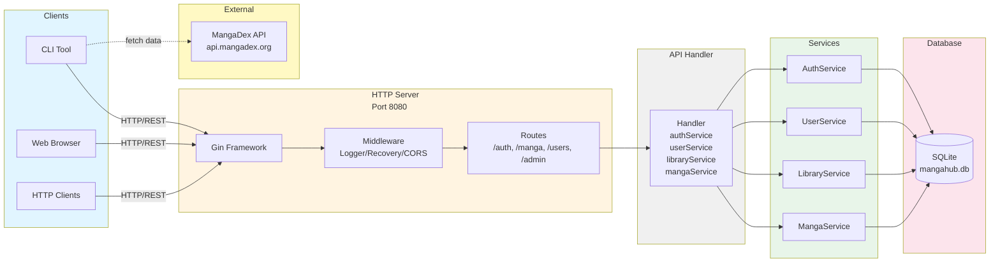
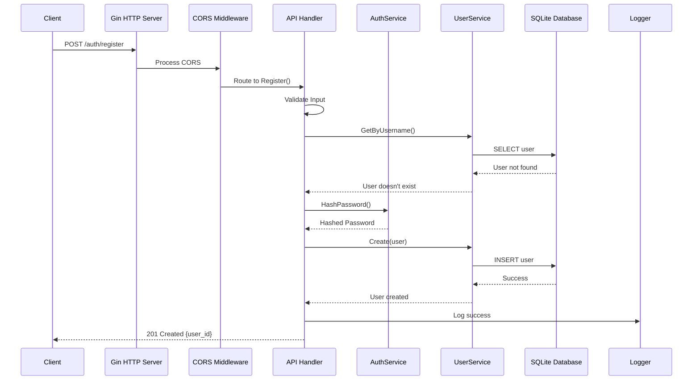
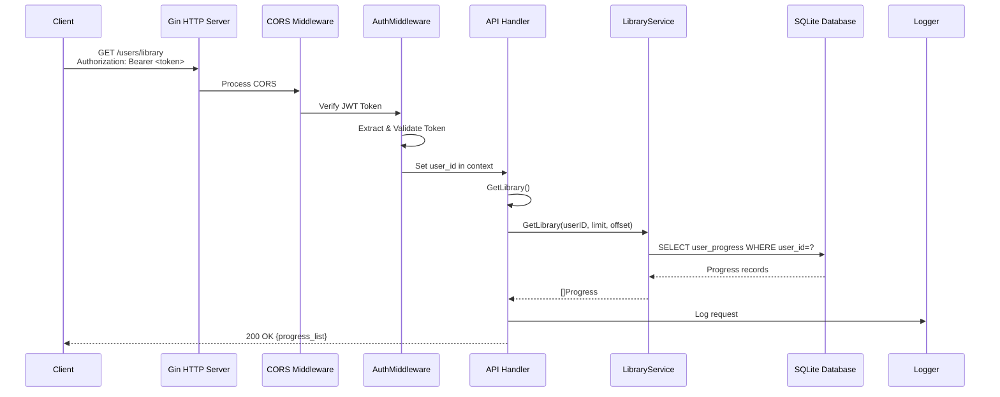

# MangaHub API Service - System Architecture Diagram

## Architecture Overview (Mermaid Diagram)



## Architecture Overview (Text Diagram)

```
┌─────────────────────────────────────────────────────────────────────────────┐
│                         CLIENT LAYER (HTTP Clients)                         │
│  ┌──────────────┐  ┌──────────────┐  ┌──────────────┐                     │
│  │   CLI Tool    │  │  Web Browser  │  │ HTTP Clients  │                     │
│  └──────┬────────┘  └──────┬────────┘  └──────┬────────┘                     │
└─────────┼──────────────────┼──────────────────┼────────────────────────────┘
          │                  │                  │
          │              HTTP/REST (Port 8080)                      │
          │                  │                  │
┌─────────▼──────────────────▼──────────────────▼──────────────────▼──────────┐
│                         HTTP SERVER LAYER                                      │
│  ┌────────────────────────────────────────────────────────────────────────┐  │
│  │                    Gin Web Framework (Gin Engine)                       │  │
│  │  ┌──────────────────────────────────────────────────────────────────┐  │  │
│  │  │                    Middleware Stack                               │  │  │
│  │  │  ┌──────────────┐  ┌──────────────┐  ┌──────────────┐          │  │  │
│  │  │  │ Gin Logger    │→ │ Gin Recovery │→ │   CORS       │          │  │  │
│  │  │  └──────────────┘  └──────────────┘  └──────────────┘          │  │  │
│  │  └──────────────────────────────────────────────────────────────────┘  │  │
│  └────────────────────────────────────────────────────────────────────────┘  │
│                                                                                │
│  ┌────────────────────────────────────────────────────────────────────────┐  │
│  │                         ROUTING LAYER                                   │  │
│  │                                                                          │  │
│  │  ┌──────────────────────────────────────────────────────────────────┐  │  │
│  │  │  Public Routes (No Auth Required)                                 │  │  │
│  │  │  ├─ POST   /auth/register      → Register()                       │  │  │
│  │  │  ├─ POST   /auth/login         → Login()                         │  │  │
│  │  │  ├─ GET    /manga              → ListManga()                     │  │  │
│  │  │  ├─ GET    /manga/:id          → GetManga()                      │  │  │
│  │  │  └─ POST   /manga/search       → SearchManga()                   │  │  │
│  │  └──────────────────────────────────────────────────────────────────┘  │  │
│  │                                                                          │  │
│  │  ┌──────────────────────────────────────────────────────────────────┐  │  │
│  │  │  Protected Routes (JWT Auth Required)                             │  │  │
│  │  │  ┌────────────────────────────────────────────────────────────┐  │  │  │
│  │  │  │  AuthMiddleware() - JWT Token Verification                  │  │  │  │
│  │  │  └────────────────────────────────────────────────────────────┘  │  │  │
│  │  │  ├─ GET    /users/profile              → GetProfile()             │  │  │
│  │  │  ├─ PUT    /users/profile              → UpdateProfile()         │  │  │
│  │  │  ├─ GET    /users/library              → GetLibrary()            │  │  │
│  │  │  ├─ POST   /users/library              → AddToLibrary()          │  │  │
│  │  │  ├─ DELETE /users/library/:mangaId     → RemoveFromLibrary()     │  │  │
│  │  │  └─ PUT    /users/library/:mangaId/progress → UpdateProgress()  │  │  │
│  │  └──────────────────────────────────────────────────────────────────┘  │  │
│  │                                                                          │  │
│  │  ┌──────────────────────────────────────────────────────────────────┐  │  │
│  │  │  Admin Routes (JWT Auth + Admin Check)                           │  │  │
│  │  │  ┌────────────────────────────────────────────────────────────┐  │  │  │
│  │  │  │  AuthMiddleware() → AdminMiddleware()                       │  │  │  │
│  │  │  └────────────────────────────────────────────────────────────┘  │  │  │
│  │  │  ├─ POST   /admin/manga        → CreateManga()                   │  │  │
│  │  │  ├─ PUT    /admin/manga/:id    → UpdateManga()                   │  │  │
│  │  │  └─ DELETE /admin/manga/:id    → DeleteManga()                   │  │  │
│  │  └──────────────────────────────────────────────────────────────────┘  │  │
│  │                                                                          │  │
│  │  ┌──────────────────────────────────────────────────────────────────┐  │  │
│  │  │  System Routes                                                    │  │  │
│  │  │  └─ GET    /health              → Health Check                   │  │  │
│  │  └──────────────────────────────────────────────────────────────────┘  │  │
│  └────────────────────────────────────────────────────────────────────────┘  │
└────────────────────────────────────────────────────────────────────────────────┘
          │
          │ Handler Methods
          │
┌─────────▼──────────────────────────────────────────────────────────────────────┐
│                         HANDLER LAYER (API Handler)                             │
│  ┌──────────────────────────────────────────────────────────────────────────┐  │
│  │  Handler Struct                                                           │  │
│  │  ├─ authService    : *auth.AuthService                                    │  │
│  │  ├─ userService    : *user.Service                                        │  │
│  │  ├─ libraryService : *user.LibraryService                                 │  │
│  │  ├─ mangaService   : *manga.Service                                       │  │
│  │  └─ logger         : *utils.Logger                                        │  │
│  └──────────────────────────────────────────────────────────────────────────┘  │
└──────────────────────────────────────────────────────────────────────────────────┘
          │
          │ Service Calls
          │
┌─────────▼──────────────────────────────────────────────────────────────────────┐
│                         SERVICE LAYER                                          │
│                                                                                 │
│  ┌─────────────────────────────────────────────────────────────────────────┐  │
│  │  AuthService (internal/auth)                                              │  │
│  │  ├─ GenerateToken(userID, username, email) → JWT Token                   │  │
│  │  ├─ VerifyToken(token) → Claims                                          │  │
│  │  ├─ HashPassword(password) → Hashed Password                             │  │
│  │  └─ VerifyPassword(hash, password) → bool                                │  │
│  └─────────────────────────────────────────────────────────────────────────┘  │
│                                                                                 │
│  ┌─────────────────────────────────────────────────────────────────────────┐  │
│  │  UserService (internal/user)                                             │  │
│  │  ├─ Create(user) → error                                                 │  │
│  │  ├─ GetByID(id) → *User                                                  │  │
│  │  ├─ GetByUsername(username) → *User                                      │  │
│  │  └─ Update(user) → error                                                 │  │
│  └─────────────────────────────────────────────────────────────────────────┘  │
│                                                                                 │
│  ┌─────────────────────────────────────────────────────────────────────────┐  │
│  │  LibraryService (internal/user)                                          │  │
│  │  ├─ GetLibrary(userID, limit, offset) → []Progress                      │  │
│  │  ├─ GetLibraryByStatus(userID, status, limit, offset) → []Progress       │  │
│  │  ├─ AddToLibrary(userID, mangaID, status, rating, notes) → error        │  │
│  │  ├─ RemoveFromLibrary(userID, mangaID) → error                          │  │
│  │  └─ UpdateLibraryEntry(progress) → error                                │  │
│  └─────────────────────────────────────────────────────────────────────────┘  │
│                                                                                 │
│  ┌─────────────────────────────────────────────────────────────────────────┐  │
│  │  MangaService (internal/manga)                                           │  │
│  │  ├─ List(limit, offset) → []Manga                                        │  │
│  │  ├─ GetByID(id) → *Manga                                                │  │
│  │  ├─ Search(filter) → []Manga                                             │  │
│  │  ├─ Create(manga) → error                                               │  │
│  │  ├─ Update(manga) → error                                               │  │
│  │  └─ Delete(id) → error                                                  │  │
│  └─────────────────────────────────────────────────────────────────────────┘  │
└──────────────────────────────────────────────────────────────────────────────────┘
          │
          │ Database Queries
          │
┌─────────▼──────────────────────────────────────────────────────────────────────┐
│                         DATABASE LAYER                                         │
│  ┌─────────────────────────────────────────────────────────────────────────┐  │
│  │  Database (pkg/database)                                                 │  │
│  │  ├─ New(path) → *Database                                                │  │
│  │  ├─ Init() → error (Schema initialization)                               │  │
│  │  ├─ Close() → error                                                       │  │
│  │  └─ SQLite Connection Pool                                                │  │
│  └─────────────────────────────────────────────────────────────────────────┘  │
│                                                                                 │
│  ┌─────────────────────────────────────────────────────────────────────────┐  │
│  │  SQLite Database (data/mangahub.db)                                       │  │
│  │  ┌──────────────┐  ┌──────────────┐  ┌──────────────┐                 │  │
│  │  │   users       │  │    manga      │  │ user_progress│                 │  │
│  │  │  - id         │  │  - id         │  │  - user_id   │                 │  │
│  │  │  - username   │  │  - title      │  │  - manga_id  │                 │  │
│  │  │  - email      │  │  - author     │  │  - status    │                 │  │
│  │  │  - password   │  │  - genre      │  │  - chapter   │                 │  │
│  │  │  - created_at │  │  - status     │  │  - rating    │                 │  │
│  │  └──────────────┘  └──────────────┘  └──────────────┘                 │  │
│  │                                                                          │  │
│  │  ┌──────────────┐  ┌──────────────┐  ┌──────────────┐                 │  │
│  │  │chat_messages │  │notifications │  │notification_ │                 │  │
│  │  │              │  │              │  │subscriptions │                 │  │
│  │  └──────────────┘  └──────────────┘  └──────────────┘                 │  │
│  └─────────────────────────────────────────────────────────────────────────┘  │
└──────────────────────────────────────────────────────────────────────────────────┘
          │
          │ Configuration
          │
┌─────────▼──────────────────────────────────────────────────────────────────────┐
│                         CONFIGURATION LAYER                                    │
│  ┌─────────────────────────────────────────────────────────────────────────┐  │
│  │  Config (pkg/config)                                                     │  │
│  │  ├─ LoadConfig(path) → *Config                                            │  │
│  │  ├─ DefaultConfig() → *Config                                            │  │
│  │  └─ config.yaml                                                           │  │
│  │     ├─ app.name, app.version, app.jwt_secret                              │  │
│  │     ├─ database.path, database.type                                       │  │
│  │     └─ http.host, http.port, http.read_timeout, etc.                      │  │
│  └─────────────────────────────────────────────────────────────────────────┘  │
└──────────────────────────────────────────────────────────────────────────────────┘
          │
          │ Logging
          │
┌─────────▼──────────────────────────────────────────────────────────────────────┐
│                         UTILITY LAYER                                          │
│  ┌─────────────────────────────────────────────────────────────────────────┐  │
│  │  Logger (pkg/utils)                                                        │  │
│  │  ├─ Info(message)                                                         │  │
│  │  ├─ Warn(message)                                                         │  │
│  │  ├─ Error(message)                                                         │  │
│  │  └─ Logs written to ~/.mangahub/logs/server.log                           │  │
│  └─────────────────────────────────────────────────────────────────────────┘  │
└──────────────────────────────────────────────────────────────────────────────────┘
```

## Component Details

### 1. HTTP Server Layer

- **Framework**: Gin Web Framework (`gin.New()` in `main.go`)
- **Port**: 8080 (configurable via `config.yaml`)
- **Global Middleware** (registered in `main.go`):
  - `gin.Logger()` - Request logging middleware
  - `gin.Recovery()` - Panic recovery middleware
  - Custom CORS middleware - Cross-origin request handling
- **Features**:
  - Graceful shutdown with configurable timeout
  - Read/Write timeouts configurable via config
  - Health check endpoint registered directly in `main.go`

### 2. Routing Structure

- **Health Check**: `GET /health` - Registered directly in `main.go` (line 79)
- **Handler Routes**: All routes registered via `handler.RegisterRoutes(engine)` in `main.go` (line 76)
  - **Public Routes** (no authentication):
    - `POST /auth/register` - User registration
    - `POST /auth/login` - User login
    - `GET /manga` - List manga (with pagination: limit, offset)
    - `GET /manga/:id` - Get manga by ID
    - `POST /manga/search` - Search manga with filters
  - **Protected Routes** (JWT required via `AuthMiddleware`):
    - `GET /users/profile` - Get user profile
    - `PUT /users/profile` - Update user profile
    - `GET /users/library` - Get user library (with pagination and optional status filter)
    - `POST /users/library` - Add manga to library
    - `DELETE /users/library/:mangaId` - Remove manga from library
    - `PUT /users/library/:mangaId/progress` - Update reading progress
  - **Admin Routes** (JWT + Admin role required via `AdminMiddleware`):
    - `POST /admin/manga` - Create manga
    - `PUT /admin/manga/:id` - Update manga
    - `DELETE /admin/manga/:id` - Delete manga

### 3. Handler Layer

- **Handler Struct** (`internal/api/handler.go`):
  - `authService` - JWT token generation/verification, password hashing
  - `userService` - User CRUD operations
  - `libraryService` - Library and progress management
  - `mangaService` - Manga CRUD and search operations
  - `logger` - Logging utility
- **Initialization**: `api.NewHandler(db, logger)` in `main.go` (line 75)
- **Request Processing**:
  - JSON binding using `c.BindJSON()`
  - Input validation using `utils.ValidateUsername()`, `utils.ValidateEmail()`, `utils.ValidatePassword()`
  - Service calls for business logic
  - Error handling with appropriate HTTP status codes
  - Structured JSON responses

### 4. Service Layer

- **AuthService**: JWT token management, password hashing
- **UserService**: User CRUD operations
- **LibraryService**: User library and progress management
- **MangaService**: Manga CRUD and search operations

### 5. Database Layer

- **SQLite** database with connection pooling
- Schema auto-initialization on startup
- Tables: users, manga, user_progress, chat_messages, notifications

### 6. Configuration

- **File**: `config.yaml` (default) or command-line argument
- **Loading**: `config.LoadConfig(path)` with fallback to `config.DefaultConfig()` if file not found
- **Settings**:
  - App: name, version, environment, JWT secret
  - Database: type (SQLite), path, timeout, max connections
  - HTTP: host, port, read/write timeouts, shutdown timeout

### 7. Utility Layer

- **Logger** (`pkg/utils`):
  - `Info()`, `Warn()`, `Error()` methods
  - Logs written to `~/.mangahub/logs/server.log`
- **Validation** (`pkg/utils`):
  - `ValidateUsername()` - Username format validation
  - `ValidateEmail()` - Email format validation
  - `ValidatePassword()` - Password strength validation

## Request Flow Examples

### User Registration Flow (Sequence Diagram)



### Get Library Flow (Sequence Diagram)



### Text Flow Examples

#### User Login Flow:

```
Client → HTTP Server → CORS Middleware → Auth Route → Register() Handler
  → AuthService.HashPassword() → UserService.Create() → Database
  → Response → Client
```

#### Get Library Flow:

```
Client → HTTP Server → CORS Middleware → AuthMiddleware (JWT Check)
  → Library Route → GetLibrary() Handler → LibraryService.GetLibrary()
  → Database Query → Response → Client
```

## Security Features

- JWT-based authentication
- Password hashing (bcrypt)
- CORS protection
- Input validation
- Admin role checking (placeholder)

## Error Handling

- Centralized error responses
- Structured JSON error messages
- Logging of all errors
- Graceful degradation
