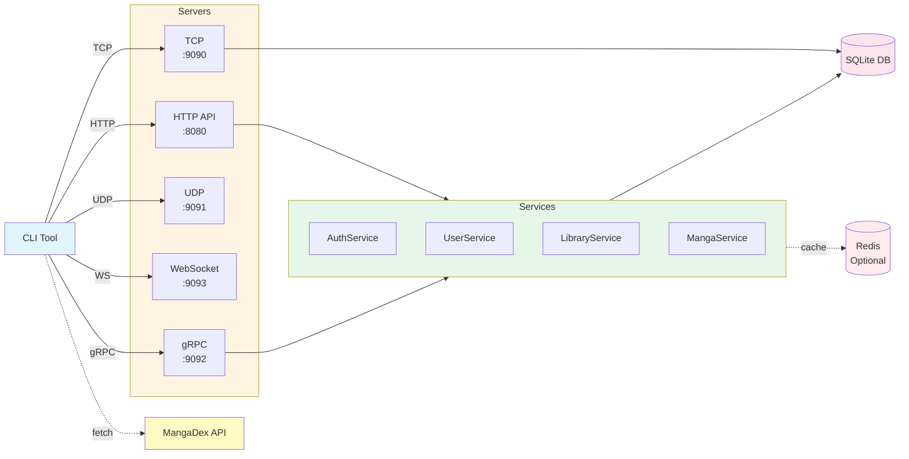

# MangaHub - System Architecture Diagram

## Overview

MangaHub is a comprehensive manga tracking system implementing 5 network protocols (HTTP, TCP, UDP, WebSocket, gRPC) with a complete CLI interface.

## System Architecture (Mermaid Diagram)



## Network Protocol Flow Diagram (Mermaid)

```mermaid
graph LR
    %% Layers
    subgraph Client["Client Layer"]
        CLI[CLI Tool<br/>mangahub CLI]
    end

    subgraph Protocols["Network Protocol Endpoints"]
        HTTP[HTTP API<br/>:8080<br/>REST + JSON]
        TCP[TCP Sync Server<br/>:9090<br/>JSON over TCP]
        UDP[UDP Notify Server<br/>:9091<br/>UDP + JSON]
        WS[WebSocket Chat Server<br/>:9093<br/>WebSocket]
        GRPC[gRPC Server<br/>:9092<br/>HTTP/2 + JSON codec]
    end
   subgraph Core["Core Services"]
        Auth[AuthService]
        User[UserService]
        Library[LibraryService]
        Manga[MangaService]
    end
   subgraph Data["Data Stores"]
        DB[("SQLite DB<br/>users, manga,<br/>user_progress,<br/>chat_messages,<br/>notifications")]
        Cache[("Redis Cache<br/>(future)")]
    end
   subgraph External["External APIs"]
        MD[MangaDex API<br/>api.mangadex.org]
    end
   %% Client → Protocols
    CLI -->|HTTP / JSON| HTTP
    CLI -->|TCP / JSON| TCP
    CLI -->|UDP| UDP
    CLI -->|WebSocket| WS
    CLI -->|gRPC (JSON)| GRPC
    CLI -.->|HTTP / JSON| MD
    %% Protocols → Core Services / Data
    HTTP -->|/auth| Auth
    HTTP -->|/users, /library| User
    HTTP -->|/library| Library
    HTTP -->|/manga| Manga
    GRPC -->|GetManga / Search / Top10| Manga
    TCP -->|save progress| DB
    UDP -->|broadcast notifications| CLI
    WS -->|chat messages| CLI
    %% Core Services → Data & Cache
    Auth --> DB
    User --> DB
    Library --> DB
    Manga --> DB
    Auth -.->|session / tokens (future)| Cache
    User -.->|profiles cache (future)| Cache
    Manga -.->|popular lists (future)| Cache
    %% Styling
    classDef client fill:#E3F2FD,stroke:#1E88E5,stroke-width:1px,color:#0D47A1;
    classDef proto_ep fill:#FFF8E1,stroke:#FFB300,stroke-width:1px,color:#E65100;
    classDef service fill:#E8F5E9,stroke:#43A047,stroke-width:1px,color:#1B5E20;
    classDef db fill:#FCE4EC,stroke:#D81B60,stroke-width:1px,color:#880E4F;
    classDef cache fill:#FFF3E0,stroke:#FB8C00,stroke-width:1px,color:#E65100;
    classDef external fill:#E1F5FE,stroke:#039BE6,stroke-width:1px,color:#01579B;
    class CLI client;
    class HTTP,TCP,UDP,WS,GRPC proto_ep;
    class Auth,User,Library,Manga service;
    class DB db;
    class Cache cache;
    class MD external;
```


## System Architecture (Text Diagram)

```
┌─────────────────────────────────────────────────────────────────────────────────┐
│                              CLIENT LAYER                                       │
│  ┌──────────────────────────────────────────────────────────────────────────┐  │
│  │                         CLI Tool (mangahub)                               │  │
│  │  Commands: auth, manga, library, progress, sync, notify, chat, grpc,     │  │
│  │            stats, export, config, db, server                              │  │
│  └──────────────────────────────────────────────────────────────────────────┘  │
└─────────────────────────────────────────────────────────────────────────────────┘
          │              │              │              │              │
          │              │              │              │              │
    ┌─────┴─────┐  ┌─────┴─────┐  ┌─────┴─────┐  ┌─────┴─────┐  ┌─────┴─────┐
    │   HTTP    │  │    TCP    │  │    UDP    │  │ WebSocket │  │   gRPC    │
    │  REST API │  │   Server  │  │  Server   │  │  Server   │  │  Server   │
    │  :8080    │  │  :9090    │  │  :9091    │  │  :9093    │  │  :9092    │
    └─────┬─────┘  └─────┬─────┘  └─────┬─────┘  └─────┬─────┘  └─────┬─────┘
          │              │              │              │              │
          │              │              │              │              │
┌─────────▼──────────────▼──────────────▼──────────────▼──────────────▼─────────┐
│                         SERVER LAYER (5 Protocols)                            │
│                                                                                │
│  ┌──────────────────────────────────────────────────────────────────────────┐  │
│  │  HTTP REST API Server (Port 8080)                                       │  │
│  │  ├─ Gin Web Framework                                                   │  │
│  │  ├─ Middleware: Logger, Recovery, CORS                                   │  │
│  │  ├─ Routes: /auth, /manga, /users, /admin                              │  │
│  │  └─ Authentication: JWT middleware                                       │  │
│  └──────────────────────────────────────────────────────────────────────────┘  │
│                                                                                │
│  ┌──────────────────────────────────────────────────────────────────────────┐  │
│  │  TCP Server (Port 9090) - Progress Sync                                  │  │
│  │  ├─ Concurrent connection handling                                       │  │
│  │  ├─ Broadcast updates to connected clients                              │  │
│  │  └─ Real-time progress synchronization                                 │  │
│  └──────────────────────────────────────────────────────────────────────────┘  │
│                                                                                │
│  ┌──────────────────────────────────────────────────────────────────────────┐  │
│  │  UDP Server (Port 9091) - Notifications                                  │  │
│  │  ├─ Client registration                                                 │  │
│  │  ├─ Broadcast messaging                                                 │  │
│  │  └─ Lightweight notification delivery                                   │  │
│  └──────────────────────────────────────────────────────────────────────────┘  │
│                                                                                │
│  ┌──────────────────────────────────────────────────────────────────────────┐  │
│  │  WebSocket Server (Port 9093) - Real-time Chat                          │  │
│  │  ├─ Room-based messaging (general, manga-specific)                       │  │
│  │  ├─ Client connection management                                        │  │
│  │  └─ Message broadcasting                                                │  │
│  └──────────────────────────────────────────────────────────────────────────┘  │
│                                                                                │
│  ┌──────────────────────────────────────────────────────────────────────────┐  │
│  │  gRPC Server (Port 9092) - Internal Services                            │  │
│  │  ├─ GetManga(id)                                                        │  │
│  │  ├─ SearchManga(filter)                                                │  │
│  │  ├─ UpdateProgress(progress)                                           │  │
│  │  └─ GetTop10Manga()                                                    │  │
│  └──────────────────────────────────────────────────────────────────────────┘  │
└──────────────────────────────────────────────────────────────────────────────────┘
          │              │              │              │              │
          │              │              │              │              │
          │              │              │              │              │
┌─────────▼──────────────▼──────────────▼──────────────▼──────────────▼─────────┐
│                         BUSINESS SERVICES LAYER                                │
│                                                                                │
│  ┌──────────────────────────────────────────────────────────────────────────┐  │
│  │  AuthService (internal/auth)                                             │  │
│  │  ├─ GenerateToken(userID, username, email) → JWT Token                  │  │
│  │  ├─ VerifyToken(token) → Claims                                         │  │
│  │  ├─ HashPassword(password) → Hashed Password                            │  │
│  │  └─ VerifyPassword(hash, password) → bool                               │  │
│  └──────────────────────────────────────────────────────────────────────────┘  │
│                                                                                │
│  ┌──────────────────────────────────────────────────────────────────────────┐  │
│  │  UserService (internal/user)                                             │  │
│  │  ├─ Create(user) → error                                                │  │
│  │  ├─ GetByID(id) → *User                                                 │  │
│  │  ├─ GetByUsername(username) → *User                                      │  │
│  │  └─ Update(user) → error                                                │  │
│  └──────────────────────────────────────────────────────────────────────────┘  │
│                                                                                │
│  ┌──────────────────────────────────────────────────────────────────────────┐  │
│  │  LibraryService (internal/user)                                          │  │
│  │  ├─ GetLibrary(userID, limit, offset) → []Progress                      │  │
│  │  ├─ GetLibraryByStatus(userID, status, limit, offset) → []Progress      │  │
│  │  ├─ AddToLibrary(userID, mangaID, status, rating, notes) → error       │  │
│  │  ├─ RemoveFromLibrary(userID, mangaID) → error                          │  │
│  │  └─ UpdateLibraryEntry(progress) → error                                │  │
│  └──────────────────────────────────────────────────────────────────────────┘  │
│                                                                                │
│  ┌──────────────────────────────────────────────────────────────────────────┐  │
│  │  MangaService (internal/manga)                                           │  │
│  │  ├─ List(limit, offset) → []Manga                                        │  │
│  │  ├─ GetByID(id) → *Manga                                                │  │
│  │  ├─ Search(filter) → []Manga                                            │  │
│  │  ├─ Create(manga) → error                                               │  │
│  │  ├─ Update(manga) → error                                               │  │
│  │  └─ Delete(id) → error                                                  │  │
│  └──────────────────────────────────────────────────────────────────────────┘  │
└──────────────────────────────────────────────────────────────────────────────────┘
          │              │              │              │
          │              │              │              │
          │              │              │              │
┌─────────▼──────────────▼──────────────▼──────────────▼─────────────────────────┐
│                         DATA LAYER                                             │
│  ┌──────────────────────────────────────────────────────────────────────────┐  │
│  │  SQLite Database (data/mangahub.db)                                      │  │
│  │  ┌──────────────┐  ┌──────────────┐  ┌──────────────┐                   │  │
│  │  │   users      │  │    manga     │  │user_progress │                   │  │
│  │  │  - id        │  │  - id        │  │  - user_id   │                   │  │
│  │  │  - username  │  │  - title     │  │  - manga_id  │                   │  │
│  │  │  - email     │  │  - author    │  │  - status    │                   │  │
│  │  │  - password  │  │  - genre     │  │  - chapter   │                   │  │
│  │  │  - created_at│  │  - status    │  │  - rating    │                   │  │
│  │  └──────────────┘  └──────────────┘  └──────────────┘                   │  │
│  │                                                                          │  │
│  │  ┌──────────────┐  ┌──────────────┐  ┌──────────────┐                   │  │
│  │  │chat_messages │  │notifications │  │notification_ │                   │  │
│  │  │              │  │              │  │subscriptions │                   │  │
│  │  └──────────────┘  └──────────────┘  └──────────────┘                   │  │
│  └──────────────────────────────────────────────────────────────────────────┘  │
└──────────────────────────────────────────────────────────────────────────────────┘
          │
          │ (Optional/Future)
          │
┌─────────▼─────────────────────────────────────────────────────────────────────┐
│                         CACHE LAYER (Optional/Future)                          │
│  ┌──────────────────────────────────────────────────────────────────────────┐  │
│  │  Redis Cache                                                              │  │
│  │  ├─ Popular manga list caching                                           │  │
│  │  ├─ User session storage                                                  │  │
│  │  ├─ Search results caching                                                │  │
│  │  ├─ Library data caching                                                  │  │
│  │  └─ Status: Not yet implemented (Bonus feature in spec)                   │  │
│  └──────────────────────────────────────────────────────────────────────────┘  │
└──────────────────────────────────────────────────────────────────────────────────┘
          │
          │
┌─────────▼─────────────────────────────────────────────────────────────────────┐
│                         EXTERNAL SERVICES                                      │
│  ┌──────────────────────────────────────────────────────────────────────────┐  │
│  │  MangaDex API (api.mangadex.org)                                         │  │
│  │  ├─ Public manga API                                                     │  │
│  │  ├─ Used by CLI: mangahub manga dex                                      │  │
│  │  ├─ Fetches up to 100 manga series                                       │  │
│  │  └─ Saves to: data/manga_api.json                                        │  │
│  └──────────────────────────────────────────────────────────────────────────┘  │
└──────────────────────────────────────────────────────────────────────────────────┘
```

## Component Details

### 1. Client Layer

**CLI Tool** (`cmd/cli`)

- Command-line interface using Cobra framework
- 50+ commands across 9 categories
- Supports all 5 network protocols
- Commands: auth, manga, library, progress, sync, notify, chat, grpc, stats, export, config, db, server

### 2. Server Layer (5 Protocols)

#### HTTP REST API Server (Port 8080)

- **Framework**: Gin Web Framework
- **Purpose**: Main API for CRUD operations
- **Endpoints**:
  - `/auth/register`, `/auth/login`
  - `/manga/*` - Browse and search manga
  - `/users/profile` - User management
  - `/users/library/*` - Library operations
  - `/admin/manga/*` - Admin operations
- **Authentication**: JWT middleware

#### TCP Server (Port 9090)

- **Purpose**: Synchronize reading progress across devices
- **Features**:
  - Concurrent connection handling
  - Saves progress updates to database (user_progress table)
  - Broadcast updates to connected clients
  - Real-time progress sync

#### UDP Server (Port 9091)

- **Purpose**: Send user notifications
- **Features**:
  - Client registration
  - Broadcast messaging
  - Lightweight notification delivery

#### WebSocket Server (Port 9093)

- **Purpose**: Real-time chat rooms
- **Features**:
  - Room-based messaging (general, manga-specific)
  - Client connection management
  - Message broadcasting

#### gRPC Server (Port 9092)

- **Purpose**: Internal service-to-service communication
- **Methods**:
  - `GetManga` - Get manga by ID
  - `SearchManga` - Search with filters
  - `UpdateProgress` - Update reading progress
  - `GetTop10Manga` - Get popular manga

### 3. Business Services

**AuthService** (`internal/auth`)

- JWT token generation and verification
- Password hashing (bcrypt)
- User ID generation

**UserService** (`internal/user`)

- User CRUD operations
- Profile management

**LibraryService** (`internal/user`)

- Library management
- Progress tracking
- Status updates

**MangaService** (`internal/manga`)

- Manga CRUD operations
- Search and filtering
- Genre management

### 4. Data Layer

**SQLite Database** (`data/mangahub.db`)

- **Tables**:
  - `users` - User accounts
  - `manga` - Manga catalog
  - `user_progress` - Reading progress
  - `chat_messages` - Chat history
  - `notifications` - User notifications
  - `notification_subscriptions` - Notification preferences
- **Features**: Auto-initialization, connection pooling

### 5. Cache Layer (Optional/Future Enhancement)

**Redis Cache** (Not currently implemented)

- **Purpose**: Cache frequently accessed data for performance
- **Potential Use Cases**:
  - Popular manga list caching
  - User session storage
  - Search results caching
  - Library data caching
- **Status**: Mentioned in project specification as bonus feature (10 pts), not yet implemented
- **Note**: Current implementation uses direct database access without caching layer

### 6. External Services

**MangaDex API** (`api.mangadex.org`)

- Public manga API
- Used by CLI `manga dex` command
- Fetches up to 100 manga series
- Saves to `data/manga_api.json`

## Communication Flow

### HTTP REST Flow

```
CLI → HTTP Server → Handler → Services → Database
```

### TCP Sync Flow

```
CLI → TCP Server → Database (save progress) → Broadcast to all clients
```

### UDP Notification Flow

```
UDP Server → CLI (registered clients)
```

### WebSocket Chat Flow

```
CLI → WebSocket Server → Hub → Broadcast to room
```

### gRPC Flow

```
CLI → gRPC Server → MangaService/LibraryService → Database
```

## Deployment

### Docker Compose

All 5 servers can be deployed together using `docker-compose.yml`:

- `api-server` - HTTP REST API
- `tcp-server` - TCP sync
- `udp-server` - UDP notifications
- `grpc-server` - gRPC services
- `websocket-server` - WebSocket chat

### Standalone

Each server can run independently:

```bash
go run ./cmd/api-server
go run ./cmd/tcp-server
go run ./cmd/udp-server
go run ./cmd/websocket-server
go run ./cmd/grpc-server
```

## Configuration

All servers use `config.yaml` for configuration:

- Port numbers
- Database path
- Timeouts
- JWT secret
- Environment settings

## Data Flow Example

### User Registration & Library Management

1. **CLI** → `mangahub auth register` → **HTTP Server** → **AuthService** → **Database**
2. **CLI** → `mangahub auth login` → **HTTP Server** → **AuthService** → Returns JWT token
3. **CLI** → `mangahub library add` → **HTTP Server** → **LibraryService** → **Database**
4. **CLI** → `mangahub sync connect` → **TCP Server** → Syncs progress across devices

### Manga Discovery

1. **CLI** → `mangahub manga dex` → **MangaDex API** → Saves to `data/manga_api.json`
2. **CLI** → `mangahub manga search` → **HTTP Server** → **MangaService** → **Database**

### Real-time Features

1. **CLI** → `mangahub chat join` → **WebSocket Server** → Real-time messaging
2. **CLI** → `mangahub notify subscribe` → **UDP Server** → Receives notifications

## Security

- **JWT Authentication**: All protected endpoints require valid JWT token
- **Password Hashing**: bcrypt for password storage
- **CORS**: Enabled for cross-origin requests
- **Input Validation**: All user inputs validated

## Scalability

- **Concurrent Connections**: TCP and WebSocket servers handle multiple clients
- **Connection Pooling**: Database connection pooling
- **Stateless Design**: HTTP API is stateless (JWT-based)
- **Docker Deployment**: Easy horizontal scaling with Docker Compose
