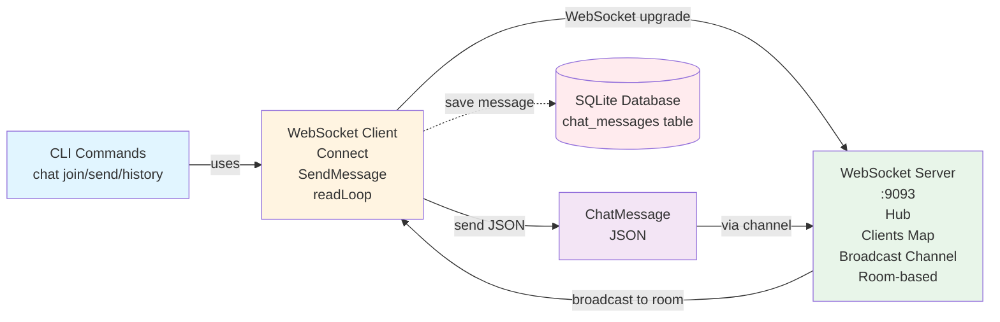

# MangaHub WebSocket Service - System Architecture Diagram

## Overview

WebSocket Service provides real-time chat functionality using WebSocket protocol. It supports room-based messaging (general chat and manga-specific discussions) with persistent connections and message broadcasting.

## WebSocket Service Architecture (Mermaid Diagram)



## WebSocket Service Architecture (Text Diagram)

```
┌─────────────────────────────────────────────────────────────────────────────────┐
│                              CLIENT LAYER                                       │
│  ┌──────────────┐  ┌──────────────┐  ┌──────────────┐                         │
│  │ CLI Client 1 │  │ CLI Client 2 │  │ CLI Client N │                         │
│  │ (Room: general)│ (Room: one-piece)│ (Room: general)│                         │
│  └──────┬───────┘  └──────┬───────┘  └──────┬───────┘                         │
└─────────┼──────────────────┼──────────────────┼───────────────────────────────┘
          │                  │                  │
          │              WebSocket Connection (ws://:9093/ws/:room)                  │
          │                  │                  │
┌─────────▼──────────────────▼──────────────────▼─────────────────────────────────┐
│                         HTTP SERVER LAYER (Gin)                                 │
│  ┌──────────────────────────────────────────────────────────────────────────┐  │
│  │  HTTP Server (Gin Framework)                                             │  │
│  │  ├─ Endpoint: GET /ws/:room                                              │  │
│  │  ├─ Query params: user_id, username                                      │  │
│  │  ├─ WebSocket Upgrader (gorilla/websocket)                                │  │
│  │  └─ Upgrades HTTP to WebSocket connection                                │  │
│  └──────────────────────────────────────────────────────────────────────────┘  │
└──────────────────────────────────────────────────────────────────────────────────┘
          │
          │ WebSocket Connection
          │
┌─────────▼─────────────────────────────────────────────────────────────────────┐
│                         WEBSOCKET HUB LAYER                                    │
│  ┌──────────────────────────────────────────────────────────────────────────┐  │
│  │  Hub (Chat Hub)                                                          │  │
│  │  ├─ Clients: map[*websocket.Conn]*ChatClient                            │  │
│  │  ├─ Broadcast: chan ChatMessage (buffer: 100)                            │  │
│  │  ├─ Register: chan *ChatClient                                           │  │
│  │  ├─ Unregister: chan *websocket.Conn                                     │  │
│  │  ├─ Thread-safe: sync.RWMutex                                            │  │
│  │  └─ Event Loop: Run() goroutine                                          │  │
│  └──────────────────────────────────────────────────────────────────────────┘  │
│                                                                                  │
│  ┌──────────────────────────────────────────────────────────────────────────┐  │
│  │  Connection Handler (HandleConnection)                                    │  │
│  │  ├─ Per-connection goroutine                                             │  │
│  │  ├─ Reads: conn.ReadJSON() → ChatMessage                                 │  │
│  │  ├─ Sets: UserID, Username, RoomID, Timestamp                            │  │
│  │  └─ Sends: message → Broadcast channel                                   │  │
│  └──────────────────────────────────────────────────────────────────────────┘  │
│                                                                                  │
│  ┌──────────────────────────────────────────────────────────────────────────┐  │
│  │  Hub Event Loop (Run)                                                     │  │
│  │  ├─ Register: Add client to Clients map                                   │  │
│  │  ├─ Unregister: Remove client, close connection                          │  │
│  │  ├─ Broadcast: Receive from Broadcast channel                             │  │
│  │  ├─ Filter: Only send to clients in same RoomID                          │  │
│  │  └─ Send: conn.WriteJSON(message) to each client in room                 │  │
│  └──────────────────────────────────────────────────────────────────────────┘  │
└──────────────────────────────────────────────────────────────────────────────────┘
          │
          │ ChatMessage Data
          │
┌─────────▼─────────────────────────────────────────────────────────────────────┐
│                         DATA MODEL                                             │
│  ┌──────────────────────────────────────────────────────────────────────────┐  │
│  │  ChatMessage (models.ChatMessage)                                       │  │
│  │  ├─ ID: string                                                           │  │
│  │  ├─ UserID: string                                                       │  │
│  │  ├─ Username: string                                                     │  │
│  │  ├─ RoomID: string (general, manga-id, etc.)                            │  │
│  │  ├─ Message: string                                                      │  │
│  │  ├─ Timestamp: int64 (Unix timestamp)                                    │  │
│  │  └─ CreatedAt: time.Time                                                 │  │
│  └──────────────────────────────────────────────────────────────────────────┘  │
│                                                                                  │
│  ┌──────────────────────────────────────────────────────────────────────────┐  │
│  │  ChatClient (models.ChatClient)                                          │  │
│  │  ├─ UserID: string                                                       │  │
│  │  ├─ Username: string                                                     │  │
│  │  ├─ RoomID: string                                                       │  │
│  │  └─ ConnID: string                                                       │  │
│  └──────────────────────────────────────────────────────────────────────────┘  │
└──────────────────────────────────────────────────────────────────────────────────┘
          │
          │ (Optional) Save to Database
          │
┌─────────▼─────────────────────────────────────────────────────────────────────┐
│                         DATA PERSISTENCE                                       │
│  ┌──────────────────────────────────────────────────────────────────────────┐  │
│  │  Database (SQLite)                                                       │  │
│  │  ├─ Table: chat_messages                                                 │  │
│  │  ├─ Save: Via CLI send command (optional)                                │  │
│  │  └─ Fields: id, user_id, username, room_id, message, timestamp           │  │
│  └──────────────────────────────────────────────────────────────────────────┘  │
└──────────────────────────────────────────────────────────────────────────────────┘
```

## Component Details

### 1. WebSocket Server (`cmd/websocket-server/main.go`)

**Server Setup:**

- **HTTP Server**: Gin framework on port 9093
- **WebSocket Endpoint**: `GET /ws/:room` with query params `user_id` and `username`
- **Health Check**: `GET /health`
- **Database**: Initialized but not directly used by Hub (messages saved via CLI)

**Key Components:**

- `Hub`: Central chat hub managing all connections
- `HandleConnection`: Upgrades HTTP to WebSocket and handles connections
- `Gin Engine`: HTTP server with logger and recovery middleware

### 2. WebSocket Hub (`internal/websocket/hub.go`)

**Hub Struct:**

- `Clients`: Map of `*websocket.Conn` to `*ChatClient` (room-based)
- `Broadcast`: Channel for chat messages (buffer: 100)
- `Register`: Channel for new client registrations
- `Unregister`: Channel for client disconnections
- `mutex`: `sync.RWMutex` for thread-safe access
- `done`: Channel for shutdown signal

**Key Methods:**

- `NewHub()`: Creates new WebSocket hub
- `Run()`: Starts hub event loop (handles Register, Unregister, Broadcast)
- `HandleConnection(conn, client)`: Handles individual WebSocket connection
- `SendMessage(message)`: Adds message to broadcast queue
- `GetClientCount()`: Returns total connected clients
- `GetRoomClientCount(roomID)`: Returns clients in specific room
- `Stop()`: Gracefully shuts down hub

**Hub Event Loop:**

- **Register**: Adds client to Clients map
- **Unregister**: Removes client from map, closes connection
- **Broadcast**: Receives message from Broadcast channel, filters by RoomID, sends to all clients in same room

### 3. Connection Handler (`internal/websocket/handler.go`)

**HandleConnection Function:**

- Upgrades HTTP connection to WebSocket using `gorilla/websocket` upgrader
- Extracts `user_id` and `username` from query parameters
- Creates `ChatClient` with UserID, Username, RoomID
- Registers client with hub
- Spawns `HandleConnection` goroutine for message reading

**Message Reading:**

- Continuously reads JSON messages via `conn.ReadJSON()`
- Sets message metadata (UserID, Username, RoomID, Timestamp)
- Sends message to Broadcast channel
- Handles connection errors and cleanup

### 4. WebSocket Client (`pkg/client/ws_client.go`)

**WebSocketClient Struct:**

- `conn`: WebSocket connection (`*websocket.Conn`)
- `serverURL`: Server WebSocket URL
- `userID`, `username`: User identification
- `roomID`: Current chat room
- `connected`: Connection status
- `messages`: Channel for received messages
- `recentMessages`: In-memory message history
- `onMessage`, `onError`, `onConnect`, `onDisconnect`: Callback functions

**Key Methods:**

- `NewWebSocketClient(serverURL, userID, username)`: Creates new client
- `Connect(roomID)`: Connects to WebSocket server at `/ws/:room`
- `Disconnect()`: Closes WebSocket connection
- `SendMessage(message)`: Sends chat message to server
- `SendPrivateMessage(targetUser, message)`: Sends private message
- `SwitchRoom(roomID)`: Disconnects and reconnects to new room
- `readLoop()`: Continuously reads messages from server
- `SetCallbacks(...)`: Sets callback functions for events

### 5. CLI Commands (`internal/cli/chat/`)

**Commands:**

- `mangahub chat join`: Join chat room (general or manga-specific), interactive mode
- `mangahub chat send <message>`: Send message to chat room
- `mangahub chat history`: View chat history from database

**Interactive Mode (chat join):**

- Real-time message display
- Commands: `/help`, `/users`, `/quit`, `/pm`, `/manga`, `/history`, `/status`
- Continuous message reading via `readLoop()`

## Communication Flow

### Client Connection Flow:

```
CLI Client → WebSocket Connect → HTTP GET /ws/:room
  → Server upgrades HTTP to WebSocket → Create ChatClient
  → Register with Hub → Add to Clients map → Start readLoop goroutine
```

### Message Send Flow:

```
CLI Client → SendMessage() → conn.WriteJSON(ChatMessage)
  → Server ReadJSON() → Set metadata → Send to Broadcast channel
  → Hub Run() → Filter by RoomID → WriteJSON to all clients in room
  → Clients receive via readLoop() → Call onMessage callback
```

### Room-Based Broadcasting:

```
Client in Room A sends message → Hub receives from Broadcast channel
  → Iterates all clients → Checks client.RoomID == message.RoomID
  → Sends only to clients in same room → Other rooms don't receive
```

## Protocol Details

### Message Format

- **Protocol**: JSON over WebSocket
- **Encoding**: UTF-8 JSON
- **Structure**: `models.ChatMessage`
- **Connection**: Persistent WebSocket connection

### WebSocket URL Format

```
ws://host:port/ws/:room?user_id=xxx&username=yyy
```

**Examples:**

- `ws://localhost:9093/ws/general?user_id=usr123&username=john`
- `ws://localhost:9093/ws/one-piece?user_id=usr123&username=john`

### Example ChatMessage:

```json
{
  "id": "msg-123",
  "user_id": "usr123",
  "username": "john",
  "room_id": "general",
  "message": "Hello everyone!",
  "timestamp": 1705312200,
  "created_at": "2024-01-15T10:30:00Z"
}
```

### Connection Lifecycle

1. **Connect**: Client calls `Connect(roomID)`, establishes WebSocket connection
2. **Upgrade**: Server upgrades HTTP to WebSocket via upgrader
3. **Register**: Client registered with Hub, added to Clients map
4. **Read Loop**: Client starts `readLoop()` goroutine to receive messages
5. **Send Messages**: Client sends messages via `WriteJSON()`
6. **Receive Messages**: Server broadcasts to all clients in same room
7. **Disconnect**: Client calls `Disconnect()`, connection closed, removed from map

## Concurrency Model

- **Hub Event Loop**: Single goroutine handling Register, Unregister, Broadcast
- **Connection Handlers**: One goroutine per WebSocket connection (read messages)
- **Client Read Loops**: One goroutine per client (receive messages)
- **Thread Safety**: `sync.RWMutex` protects `Clients` map
- **Channel Buffering**: Broadcast channel buffer (100) prevents blocking

## Room Management

- **General Room**: Default room (`roomID = "general"`)
- **Manga Rooms**: Manga-specific rooms (`roomID = manga-id`)
- **Room Isolation**: Messages only broadcast to clients in same room
- **Room Switching**: Client can disconnect and reconnect to different room

## Database Integration

- **Optional**: Messages can be saved to `chat_messages` table via CLI `send` command
- **Not Required**: Hub does not directly save messages to database
- **History**: CLI `history` command reads from database
- **Table**: `chat_messages` with fields: id, user_id, username, room_id, message, timestamp

## Error Handling

- **Connection Errors**: Logged, connection removed from map
- **JSON Parse Errors**: Logged, message skipped
- **Write Errors**: Logged, connection unregistered
- **Unexpected Closures**: Handled gracefully, connection cleaned up
- **Graceful Shutdown**: All connections closed on `Stop()`

## Configuration

**From `config.yaml`:**

```yaml
websocket:
  host: 0.0.0.0
  port: 9093
```

## Use Cases

1. **General Chat**: Users discuss in general chat room
2. **Manga Discussions**: Users discuss specific manga in manga-specific rooms
3. **Real-time Messaging**: Instant message delivery to all room participants
4. **Interactive Chat**: CLI interactive mode with commands

## Performance Considerations

- **Persistent Connections**: WebSocket maintains long-lived connections
- **Room-Based Filtering**: Efficient message routing by room
- **Channel Buffering**: Prevents blocking on broadcast channel
- **Goroutine Per Connection**: Efficient I/O handling
- **In-Memory Client List**: Fast lookups, but lost on server restart

## Differences from TCP/UDP Services

- **Persistent Connections**: WebSocket maintains connections vs. stateless UDP
- **Room-Based**: Messages filtered by room vs. broadcast to all (TCP/UDP)
- **Bidirectional**: Full-duplex communication vs. one-way (UDP)
- **HTTP Upgrade**: Uses HTTP upgrade mechanism vs. raw socket (TCP)
- **Optional Database**: Messages optionally saved vs. required (TCP) or none (UDP)
